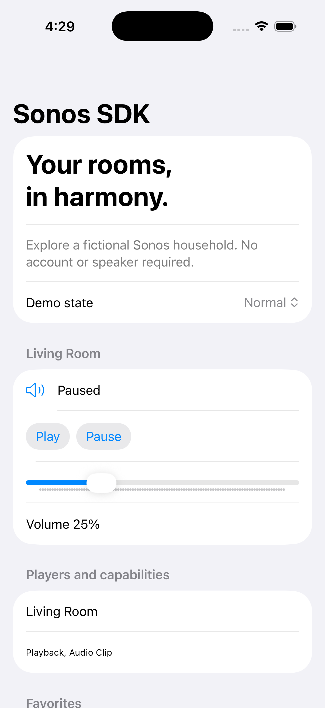

# Sonos Swift SDK

A Swift 6 client for Sonos households, groups, playback, volume and favorites. Foundation networking and optional SwiftUI authentication are separate products. The included iPhone, iPad and macOS demo starts with a fictional household: no account, server or speaker required.



## Quick start

Requires Xcode 26.6 / Swift tools 6.3; iOS/iPadOS 18+ or macOS 15+.

```sh
git clone https://github.com/JimmyJammed/sonos-swift-sdk.git
cd sonos-swift-sdk
swift test
open SonosDemo.xcodeproj
```

Run SonosDemo on iOS or SonosDemoMac on macOS. Choose a demo state to explore empty, disconnected, expired and unsupported responses. Play/pause/volume send fixture commands by default.

Add this repository in Xcode Package Dependencies and select `SonosSDK`; add `SonosSDKUI` only for native authentication presentation. The networking dependency is pinned to the reviewed 2.0 implementation commit, so installation does not require an unpublished version tag.

```swift
import SonosSDK
let client = SonosClient(tokens: FixtureTokenProvider(),
    http: try SonosHTTPClient(transport: FixtureTransport()))
let households = try await client.households()
```

## Documentation

- [API and support](docs/API.md), [customization](docs/CUSTOMIZATION.md), [architecture](docs/ARCHITECTURE.md)
- [Local authentication server and live setup](Server/README.md)
- [2.0 migration](docs/MIGRATION.md), [troubleshooting](docs/TROUBLESHOOTING.md)
- [Validation](docs/VALIDATION.md), [contribution guide](CONTRIBUTING.md), [changelog](CHANGELOG.md)

Sonos client secrets and refresh credentials stay on the server. Never embed the server bootstrap credential in an app. Live account/device validation is separate from the fixture demo. Existing license and attribution remain in LICENSE.
